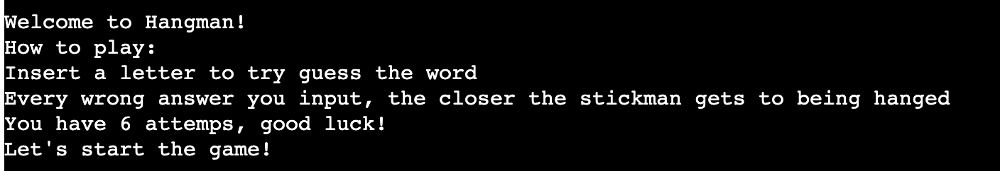
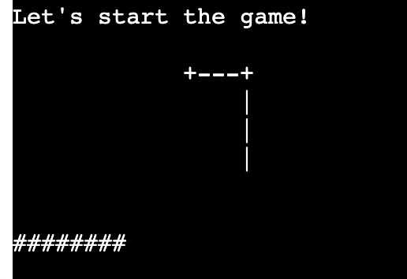
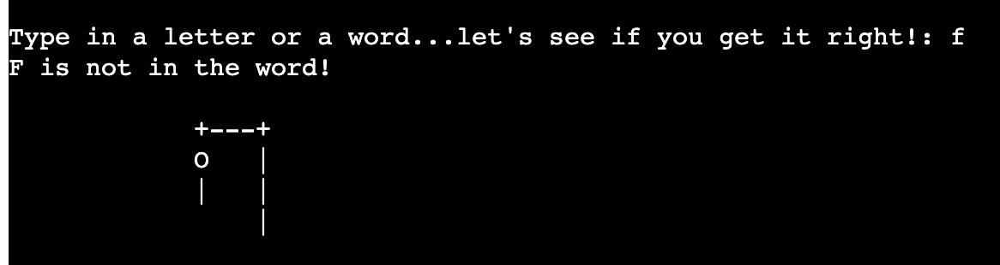
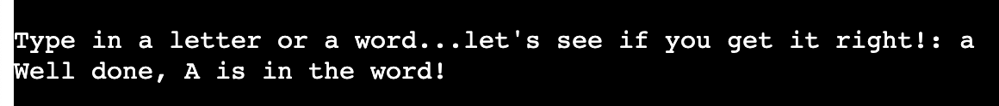
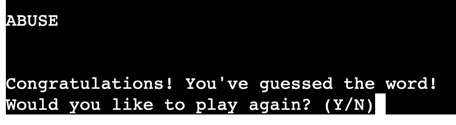
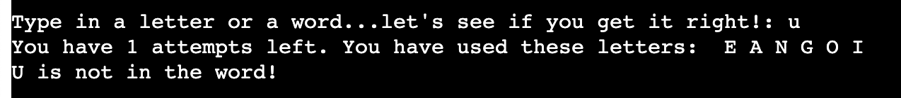
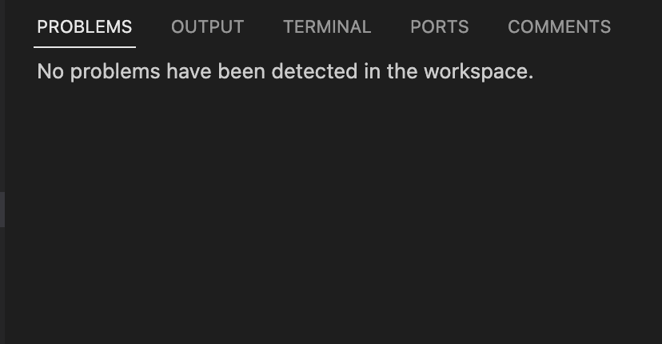
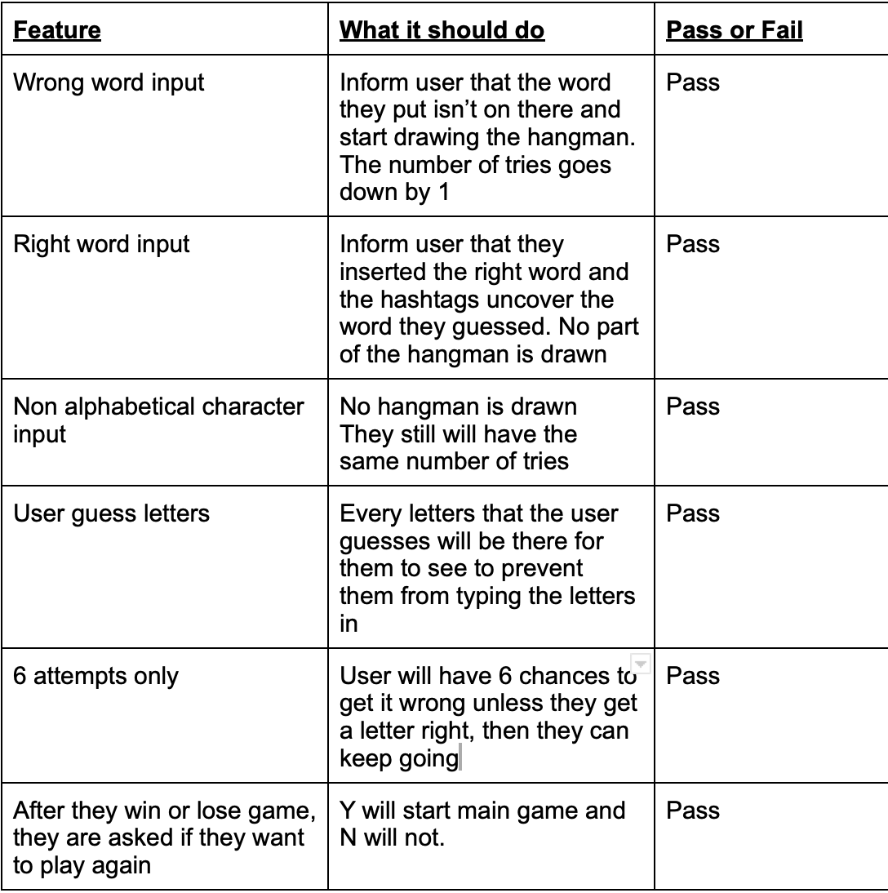

# Hangman

Hangman is a straightforward game that requires a player to guess a specific word that has been randomly selected. 
 The players need to guess letters from the alphabet and have 6 attempts to try and get it right.
Each answer they get wrong leads to the process of the stickman getting hanged and the aim is to stop
this from happening.

[My Project](https://hangman-pyth-eee58bb863df.herokuapp.com/)

## Features

### Existing features

- Intro to the game

    - The user is welcomed into the game. 
    - This is then followed by a small section to instruct the user how to play. 
    - They are then met with a message that prompts them to start playing the game. 

     - 

- Main game area

    - The hashtags represent the random word that has been selected 
    - The empty drawing of the where the hangman would be suggests the intial state of the hangman 
    because the user hasn't inserted a wrong letter just yet

     - 

    - The user will get a specific response letting them know if the letter the chose is not in the selected word
    - This will also be followed by the hangman being drawn
    - If the letter that the user has typed in isn't part of the alphabet, there will be no response
    - This will indicate that the user has typed an invalid character. It won't take away the number of attempts
    
     - 

    - The user will also get a response if the letter they input was in the word they're looking for

     - 

    - The user will be congratulated if they end up guessing the word
    - They will also be asked if they want to play again

     - 

    - The user will also have the letters that they have chosen on display
    - This prevents them from typing the same letter again and again
    - This is also followed by the number of attempts they have left so the user is aware

     - 

### Features left to implement

- A feature to allow the user to type in a username
- This may have personalised the experience of the game to the user

## Testing

### Validators

- Pycodestyle](https://pypi.org/project/pycodestyle/) was installed in the terminal to allow detections for errors and problems 
- 

- The python code syntax was also tested continously throughout this website to ensure there would be no syntax issue affecting the code. [Python syntax checker](https://extendsclass.com/python-tester.html)

### Feature Testing

- 

## Technologies used

### Frameworks, Libraries & Programs Used   

- [Git](https://git-scm.com/): commited and pushed code to github.
- [Github](https://github.com/): where all the pushed code was stored.
- [Responsiveness](https://www.websiteplanet.com/webtools/responsive-checker/#body): Used to check the screen responsiveness in many different types of screens.

## Deployment
- [Heroku][https://dashboard.heroku.com/apps] was used to deploy the app and it was connected to the github repository.
- To deploy on Heroku:
    - Go on settings
    - Click reveal ConFig and insert PORT as the key and 8000 as the value
    - Add Python and node.js as buildpacks
    - Go on Deploy
    - Connect it to you github
    - Make sure it is to the main branch 
    - click deploy

## Bugs

- No known bugs

## Credits

- [This website](https://hangmanwordgame.com/?fca=1&success=0#/) was used to ensure understanding of how the game is meant to be played.
- [Youtube](https://www.youtube.com/) allowed some help so to sort the code out properly
- [W3Schools](https://www.w3schools.com/) presented information on which code would be more suitable for the game

